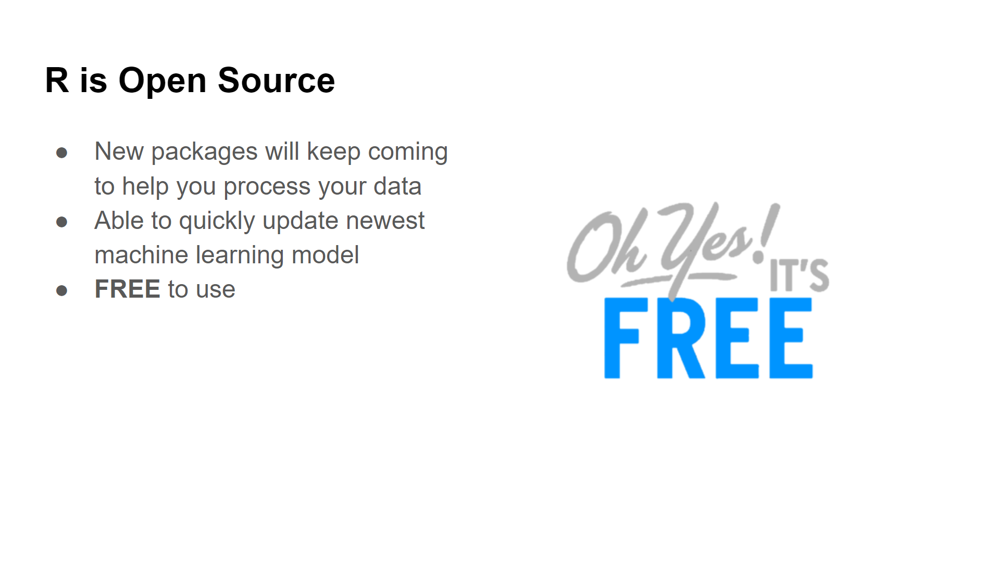

```{r setup, include=FALSE}
knitr::opts_chunk$set(echo = FALSE)
```

#

Slide ini dibuat untuk kebutuhan Trial Class Algoritma

```{r}

```

## Objectives

Trial Class ini adalah pengalaman belajar singkat di kelas Algoritma. Materi yang akan dibawakan meliputi:

- Perkenalan Ke Dunia Data Science
- Eksplorasi Data  
- Visualisasi Data

# Perkenalan Dunia Data Science

## Apa itu Data Science? 

## Definisi Data Science

```{r}
knitr::include_graphics("assets/data_science_definition.PNG")
```

## Implementasi Data Science

```{r}

```

# Data Science Tools

## Tools 

```{r}

```

## Tools & Analogy

```{r}
knitr::include_graphics("assets/data_science_tools.png")
```

## Kenapa Belajar R?

## R Sangat Mudah Untuk Digunakan 

```{r}

```

## Big Data

```{r}

```

## Sudah Digunakan Oleh Banyak Perusahaan Besar

```{r}

```

## Banyak Sumber Informasi

```{r}

```

## Gratis

```{r}

```

# Langkah Awal Menjadi Seorang Data Scientist

## Mempelajari Bagaimana Mengolah Data

Study Case: Transaksi Retail Secara Online

```{r, message=FALSE, warning=FALSE}
library(dplyr)
library(rmarkdown)

retail <- read.csv("data_input/retail.csv")

retail %>% 
  paged_table() %>% 
  head()
```

## Kasus 1:

Bagaimanakah performa penjualan untuk setiap segment barang yang dijual pada perusahaan retail tersebut?

## Hasil Eksplorasi Data 

```{r}
df1 <- retail %>% 
  group_by(Category) %>% # Kita isi dengan nama kolom yang datanya ingin kita kelompokan 
  summarise(Total = sum(Sales)) %>% # Kita isi denan rumus matematikan yang kita inginkan 
  arrange(desc(Total))

paged_table(df1)
```

## Hasil Visualisasi

```{r,message=FALSE,warning=FALSE}
library(ggplot2)
library(glue)
library(plotly)
library(scales)
options(scipen = 1)

plot1 <- df1 %>% 
  ggplot(mapping = aes(y = reorder(Category, Total), 
                       x = Total, 
                       text =  glue("{Category}
                         Sales: {comma(Total, 3)}"))) +
  geom_col(mapping = aes(fill = Category)) +
  scale_x_continuous(labels = comma) +
  labs(title = "Performa Penjualan Untuk Setiap Category",
       y = "Category",
       x = "Performa Sales") +
  theme_minimal()+
  theme(legend.position = "none")

ggplotly(plot1, tooltip = "text")
```

## Kasus 2:

Bagaimana rekam penggunaan mode pengiriman barang? Mode pengiriman apa yang paling sering digunakan? 

## Hasil Eksplorasi Data

```{r}
retail %>% 
  group_by(Ship.Mode) %>% # Kita isi dengan nama kolom yang datanya ingin kita kelompokan 
  summarise(Freq = n()) %>% # Kita isi dengan rumus matematikan yang kita inginkan 
  arrange(desc(Freq)) %>% 
  paged_table()
```

## Hasil Visualisasi

```{r,message=FALSE,warning=FALSE}
library(ggplot2)
library(glue)
library(plotly)
library(scales)

plot2 <- retail %>% 
  group_by(Ship.Mode) %>% 
  summarise(Freq = n()) %>% 
  arrange(desc(Freq)) %>% 
  ggplot(mapping = aes(x = reorder(Ship.Mode, Freq), 
                       y = Freq, 
                       text =  glue("{Ship.Mode}
                         Shipment: {comma(Freq)}"))) +
  geom_col(mapping = aes(fill = Ship.Mode)) +
  labs(title = "Jumlah Pelanggan Berdasarkan Tipe Pengiriman",
       x = "Tipe Pengiriman",
       y = "Total Pelanggan") +
  theme_minimal()+
  theme(legend.position = "none")

ggplotly(plot2, tooltip = "text")
```

# Mari Kita Coba Pelajari!