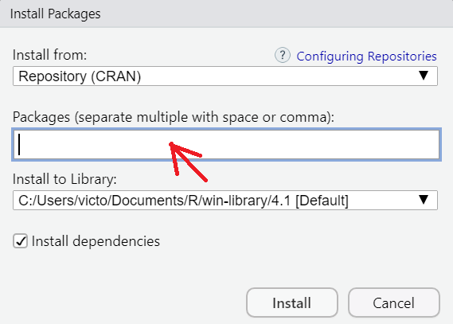

```{r setup,echo=FALSE}
# clear-up the environment
rm(list = ls())

# chunk options
knitr::opts_chunk$set(
  message = FALSE,
  warning = FALSE,
  fig.align = "center",
  comment = "#>"
)

# prevent scientific notation
options(scipen = 9999)
```

# Introduction

Pada Algoritma Trial Class kali ini, kita akan menyelesaikan beberapa pertanyaan bisnis terkait data transaksi suatu perusahaan retail. Selama melakukan analisis, kita akan juga berkenalan dengan basic R programming serta proses data analysis di R mulai dari pembacaan data, eksplorasi data hingga visualisasi menggunakan R. Hasil analisis kemudian dapat di eksport ke dalam format reporting.

# Introduction R Studio UI

Sebelum itu mari kita coba berkenalan dengan R Studio UI, dengan melihat gambar di bawah ini.

```{r}
# Pada R Studio kita juga bisa memasukan gambar dengan menggunakan code di bawah ini
knitr::include_graphics("assets/RStudio_UI.PNG")
```

# Introduction to R Markdown

Rmd merupakan sebuah format markdown yang dikembangkan oleh R Studio yang dapat dimanfaatkan oleh seseorang yang bekerja di bidang data dalam melakukan analisis dan mengtransformasinya menjadi sebuah laporan yang berbentuk HTML, PDF ataupun Word.

Berikut beberapa hal yang akan sering kita gunakan dalam melakukan analisis pada Rmd.

- *Chunk*

Bagian abu-abu dari Rmarkdown adalah `chunk`. Chunk berguna untuk menulis code.

**Shortcut:** ctrl + alt + i

```{r}
# code di sini

```

- *White Space*

Bagian putih dari R Markdown (.Rmd) berguna untuk menulis narasi. Pada bagian ini dapat ditambahkan heading dengan menambahkan hashtag `#` sebelum kalimat. Narasi yang tidak ditambahkan `#` sebelum kalimat akan menjadi paragraf biasa.

`#` -> Heading 1   
`##` -> Heading 2   
`###` -> Heading 3   

Sedangkan jika simbol `#` digunakan di dalam sebuah Chunk, maka akan menjadi sebuah comment.

- *Other Shortcut*

```{r}
 
```

# Study Case: Retail Performance Analysis

Kita memiliki rekam data transaksi penjualan barang online dari suatu perusahaan retail. Dari rekam data tersebut, kita ingin menganalisis performa penjualan retail dan penarikan insight lain yang dapat bermanfaat untuk menjawab pertanyaan bisnis yang ada.

*Business Questions*

- Q1: Bagaimanakah performa penjualan untuk setiap segment barang yang dijual pada perusahaan retail tersebut?     
- Q2: Bagaimana rekam penggunaan mode pengiriman barang? Mode pengiriman apa yang paling sering digunakan?   

*Workflow*

1. Library/Packages Preparation
2. Import Data
3. Exploratory Data Analysis
4. Visualize

## Library/Packages Preparation

Library/Package adalah sekumpulan fungsi yang digunakan untuk pengolahan data tertentu. Untuk menggunakan fungsi-fungsi pada suatu package, harus dilakukan instalasi package ke komputer terlebih dahulu.

Untuk menginstal packages, klik tab panel **Packages** pada bagian kanan bawah RStudio, kemudian klik tombol **install**. Masukan list package berikut ke dalam kolom package yang ingin di-instal (ragam package yang digunakan pada Trial Class). Untuk mendapatkan ilustrasi yang lebih jelas bisa melihat gambar di bawah ini.

```{r}

```

Nantinya setelah klik tombol install akan muncul sebuah pop-up baru. Dari pop-up tersebut, kita dapat mengisi library apa saja yang ingin kita isntall pada bagian **Packages**. Untuk mendapatkan ilustrasi yang lebih jelas bisa melihat gambar di bawah ini.

```{r}

```

Berikut adalah library yang akan kita gunakan dalam melakukan analisis.

- `dplyr`: Library ini diperuntukkan untuk membantu kita dalam melakukan analisis.
- `ggplot2`: Library ini diperuntukkan untuk membantu kita dalam melakukan visualisasi statis.
- `scales`: Library ini diperuntukkan untuk membantu kita dalam mempercantik visualisasi statis.
- `plotly`: Library ini diperuntukkan untuk membantu kita dalam melakukan visualisasi interaktif.
- `glue`: Library ini diperuntukkan untuk membantu kita dalam mempercantik visualisasi interaktif.

Setelah berhasil melakukan instalasi ke-5 library yang kita butuhkan, kita harus memanggil library tersebut terlebih dahulu. Untuk memanggil library tersebut kita akan menggunakan fungsi `library()`.

```{r}
# Aktifasi library
library(dplyr) 
library(ggplot2)
library(scales)
library(plotly)
library(glue) 
```

Additional Info: Berikut adalah contoh dari Library/Package merupakan sekumpulan fungsi yang digunakan untuk pengolahan data tertentu.

## Import Data

Tahapan selanjutnya yang akan kita lakukan adalah melakukan pemanggilan data yang akan diolah. Data yang akan kita panggil disini adalah data yang sudah tersimpan dalam sebuah folder `data_input` dengan nama `retail.RDS`. Dalam melakukan import data, kita akan mencoba menggunakan fungsi baru, yaitu `readRDS()`.

Syntax fungsi tersebut: `readRDS("nama_folder/nama_file")`

```{r}
retail <- 
```

Kita menyimpan data tersebut ke dalam sebuah object bernama `retail` menggunakan tanda `assignment` (<-). Objek akan disimpan dalam environment R dan dapat diolah lebih lanjut. 

Agar kita dapat melihat isi data tersebut kita dapat memanggil object `retail`, dimana kita menyimpan data yang sudah kita baca.

```{r}
retail
```

Deskripsi kolom:

- `Row.ID` = Nomer baris
- `Order.ID` = Unique ID pemesanan
- `Order.Date` = Tanggal pemesanan
- `Ship.Date` = Tanggal pengiriman barang
- `Ship.Mode` = Jenis pengiriman yang dipilih customer
- `Customer.ID` = Unique ID customer
- `Segment` = Segmentasi/kategori custoemr
- `Product.ID` = Unique ID barang
- `Category` = Kateogri barang
- `Sub.Category` = Sub Kategori barang
- `Product.Name` = Nama produk barang
- `Sales` = Total sales dari barang yang dibeli oleh customer
- `Quantity` = Total barang yang dibeli oleh customer
- `Discount` = Total diskon yang diberikan kepada customer
- `Profit` = Total keuntungan yang didapatkan oleh perusahaan

Additional Info: 

Kita dapat membaca berbagai macam tipe file data di R, berikut adalah beberapa contoh file yang dapat kita baca di R.

- `.Rds`: File dalam format R.
- `.csv`: File dalam format csv(comma seperated value).
- `.xlsx`: File dalam formal excel.

Selain membaca data yang sudah tersimpan dalam komputer kita, R Studio juga dapat kita sambungkan ke database untuk mengambil data-data yang tersimpan pada database tersebut.

## Exploratory Data Analysis

*Exploratory Data Analysis* bertujuan untuk mendapatkan insight dari data sesuai pertanyaan bisnis yang diajukan. Dari data retail, kita akan coba menjawab pertanyaan bisnis berikut:

Q1: Bagaimanakah performa penjualan (`Sales`) untuk setiap category (`Category`) barang yang dijual pada perusahaan retail tersebut?

Berikut adalah beberapa fungsi dari library dplyr yang akan kita gunakan untuk menjawab pertanyaan bisnis tersebut.

- `group_by()`: Fungsi ini dapat kita manfaatkan untuk mengelompokkan setiap segment barang pada data kita.
- `summarise()`: Fungsi ini dapat kita manfaatkan untuk melakukan perhitungan matematis, untuk melakukan penjumlahan hasil penjualan untuk setiap segment barang yang dimiliki.
- `arrange(desc())`: Fungsi ini dapat kita manfaatkan untuk mengurutkan nilai yang ada

Additional Notes: Simbol `%>%` adalah simbol yang dapat kita manfaatkan untuk menyambung setiap fungsi yang kita gunakan.

```{r}
retail %>% 
  group_by(...) %>% # Kita isi dengan nama kolom yang datanya ingin kita kelompokan 
  summarise(...) %>% # Kita isi dengan rumus matematikan yang kita inginkan 
  arrange(desc(...)) # Jika ingin mengurutkan secara ascending, kita bisa tambahkan dengan desc(berdasarkan_value apa)
```

Dari hasil yang kita dapatkan apakah ada insight yang dapat kita dapatkan?

- 

Q2: Bagaimana rekam penggunaan mode pengiriman barang (`Ship.Mode`)? Mode pengiriman apa yang paling sering digunakan?  

- `group_by()`: Fungsi ini dapat kita manfaatkan untuk mengelompokkan setiap mode pengiriman barang pada data kita.
- `summarise()`: Fungsi ini dapat kita manfaatkan untuk melakukan perhitungan matematis, untuk menghitung frekuensi pengiriman apa yang sering digunakan.
- `arrange(desc())`: Fungsi ini dapat kita manfaatkan untuk mengurutkan nilai yang ada

```{r}
retail %>% 
  group_by(...) %>% # Kita isi dengan nama kolom yang datanya ingin kita kelompokan 
  summarise(...) %>% # Kita isi dengan rumus matematikan yang kita inginkan 
  arrange(desc(...)) # Jika ingin mengurutkan secara ascending, kita bisa tambahkan dengan desc(berdasarkan_value apa)
```

Dari hasil yang kita dapatkan apakah ada insight yang dapat kita dapatkan?

- 

## Visualize

Eksplorasi data telah mampu menjawab pertanyaan business yang diajukan. Namun alangkah lebih baik bila hasil agregasi data dapat divisualisasikan sehingga lawan bicara lebih tertarik dan mudah menangkap informasi yang ingin disampaikan.

Pada bahasa pempogramman R, terdapat 2 jenis visualisasi yang dapat kita gunakan, yaitu: *Visualisasi Base* dan *Visualisasi Grammar of Graphic*

- *Visualisasi Base*

Jenis visualisasi ini biasanya digunakan untuk keperluan pribadi saja karena tampilannya cenderung sederhana dan code nya pun singkat. Untuk membuat visualisasi tersebut, fungsi yang akan kita gunakan adalah `plot()`.

Berikut contoh Visualisasi Base untuk kasus bisnis yang kedua.

```{r}
plot(retail$Ship.Mode)
```

- *Visualisasi Grammar of Graphic*

Sedangkan ketika kita ingin membuat plot yang apik (*ready-to-publish*), kita umumnya menggunakan package tambahan yang menyediakan fitur-fitur visualisasi yang lebih menarik seperti `ggplot2`. `ggplot2` atau *Grammar of Graphics* adalah salah satu package visualisasi di R yang sagat powerful dan mempunyai banyak fitur dan ekstensi. Visualisasi data secara detail akan banyak dibahas pada spesialisasi Data Visualization di Algoritma Academy.

Berikut adalah contoh Visualisasi Grammar of Graphics untuk kasus bisnis yang kedua.

```{r}
retail %>% 
  group_by(Ship.Mode) %>% 
  summarise(Freq = n()) %>% 
  arrange(desc(Freq)) %>% 
  ggplot(mapping = aes(x = reorder(Ship.Mode, Freq), y = Freq)) +
  geom_col(mapping = aes(fill = Ship.Mode)) +
  labs(title = "Total Ship Mode",
       x = "Ship Mode",
       y = "Total Frekuensi") +
  theme_minimal()
```

Berikut adalah catatan tentang fungsi-fungsi yang digunakan di atas:   

- `ggplot(mapping = aes(x = , y = ))` : buat kanvas plot dimana **sumbu x** adalah `Ship.Mode` dan **sumbu y** adalah kolom `Freq`.
- `geom_col(aes(fill = Ship.Mode))` : buat **bar plot** dan warnai **fill** (area) bar nya berdasarkan `Segment`.
- `labs()`: mengatur komponen text pada plot
  ~ `title`: judul plot
  ~ `x` = judul sumbu x 
  ~ `y` = judul sumbu y
- `theme_minimal()` : Memberikan pre-built theme dari ggplot2

Untuk lebih memahaminya, mari kita coba breakdown satu persatu proses pembuatan Visualisasi Grammar of Graphics.

*Step 1:* Dari hasil persiapan data yang sudah kita miliki mari kita tambahkan fungsi `ggplot()`. 

Parameter pada fungsi `ggplot()`,

Contoh Syntax: `ggplot(mapping = aes(x = ..., y = ...))`

- `mapping` = parameter ini akan di isi dengan *Aesthetic / aes()*, aes() adalah fungsi yang bisa diisi dengan elemen-elemen yang penting dalam grafik, meliputi sumbu x, sumbu y.

```{r}

```

*Step 2:* Menambahkan jenis visualisasi yang ingin kita gunakan, dalam kasus ini kita akan menambahkan fungsi `geom_col()` untuk membuat bar plot.

Parameter pada fungsi `geom_col()`

Contoh Syntax: `geom_col(mapping = aes(fill = ...))`

- `mapping` = sama dengan fungsi `ggplot()`, parameter mapping di sini juga akan kita tambahkan fungsi `aes()`. Fungsi `aes()` di sini akan kita isi dengan parameter `fill =` untuk memberikan warna pada setiap bar plot kita.

Additional Notes:  Simbol `+` adalah simbol yang dapat kita manfaatkan untuk menyambung setiap fungsi visualisasi yang kita gunakan.

```{r}

```

*Step 3:* Tahapan selanjutnya yang akan kita lakukan di sini adalah memperjelas semua informasi pada plot yang kita buat dengan menambahkan fungsi `labs()`.

Contoh Syntax: `labs(title = ..., x = ..., y = ...)`

Parameter pada fungsi `labs()`

- `title` = Untuk menambahkanjudul plot
- `x` = Untuk mengubah judul sumbu x 
- `y` = Untuk mengubah judul sumbu y

```{r}

```

*Step 4:* Tahapan terakhir yang akan kita lakukan adalah memberikan pre-built theme yang sudah disediakan dari `library(ggplot2)`. Berikut adalah beberapa pre-built theme yang dapat kita gunakan: `theme_minimal()`, `theme_bw()` dan `theme_classic()`.

```{r}

```

# Bonus - Interactive Ploting

Dalam mentransformasi visualisasi statis menjadi visualisasi interaktif terdapat 2 hal yang dapat kita tambahkan. Hal yang pertama kali kita perlu tambahkan adalah parameter `text = ` pada fungsi `ggplot()`. Parameter tersebut berguna untuk memunculkan text yang ingin kita tampilkan. Text yang ingin kita munculkan bisa kita tambakan dengan menggunakan fungsi `glue()`. 

```{r}
plot_statis <- retail %>% 
  group_by(Ship.Mode) %>% 
  summarise(Freq = n()) %>% 
  arrange(desc(Freq)) %>% 
  ggplot(mapping = aes(x = reorder(Ship.Mode, Freq), 
                       y = Freq, 
                       # Parameter text dan fungsi glue ditambahkan pada bagian ini
                       text = glue("{Ship.Mode} 
                                     Shipment: {comma(Freq)}"))) + 
  geom_col(mapping = aes(fill = Ship.Mode)) +
  labs(title = "Jumlah Pelanggan Berdasarkan Tipe Pengiriman",
       x = "Tipe Pengiriman",
       y = "Total Pelanggan") +
  theme_minimal()+
  theme(legend.position = "none")
```

Setelah menambahkan text apa yang ingin kita munculkan pada visualisasi interaktif, kita akan memasukan hasil visualisasi statisnya ke sebuah fungsi yang bernama `ggplotly()`. Pada fungsi tersebut nantinya kita bisa isi dengan tambahan parameter yaitu `tooltip =`. Parameter tersebut berguna untuk memunculkan text yang sudah kita persiapkan di parameter `text = ` pada fungsi `ggplot()`.

```{r}
ggplotly(plot_statis, tooltip = "text")
```

# Bonus -  Laporan R Markdown

File yang kita gunakan selama trial class ini juga dapat kita ubah menjadi laporan dengan format **PDF**, **HTML** ataupun **Word**. 

Untuk melakukan transformasi R Markdown menjadi format yang kita inginkan, kita bisa mengklik tombol **knit** dan memilih format file yang di-inginkan. Untuk ilustrasi yang lebih jelas, bisa melihat gambar di bawah ini.

```{r echo=FALSE, out.width="90%"}
knitr::include_graphics(path = "assets/knit.png")
```

Knit atau proses transformasi file R Markdown menjadi format yang kita inginkan akan berdasarkan opsi **YAML**. YAML itu sendiri merupakan parameter yang akan mengatur hasil transformasi. Untuk detail mengenai pengaturan YAML, kami sudah menyediakan penjelasan secara terpisah pada file `reporting-in-r.html`.

- *Format HTML*

```{r echo=FALSE, out.width="90%"}
knitr::include_graphics(path = "assets/htmldoc.png")
```

- *Format PDF*

```{r echo=FALSE, out.width="90%"}
knitr::include_graphics(path = "assets/pdfdoc.png")
```

- *Format Word*

```{r echo=FALSE, out.width="90%"}
knitr::include_graphics(path = "assets/worddoc.png")
```


