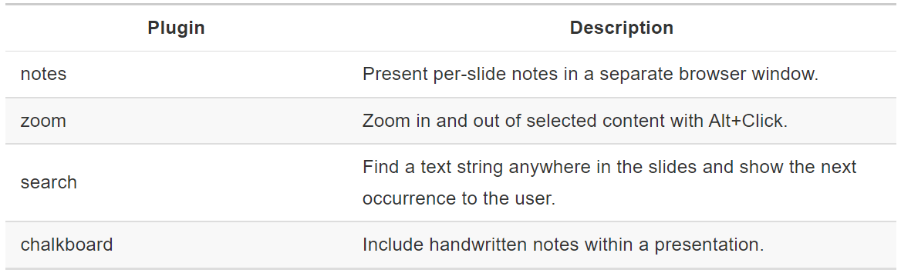

```{r setup, include=FALSE}
# clear-up the environment
rm(list = ls())

# chunk options
knitr::opts_chunk$set(
  message = FALSE,
  warning = FALSE,
  fig.align = "center",
  comment = "#>"
)
```

<style>

body {
text-align: justify}

</style>

\break

# Laporan dari R Markdown

Seringkali pengguna perlu membuat laporan bisnis dalam berbagai format. Misalnya, seseorang membutuhkan laporannya untuk dibagikan dengan rekan satu timnya dalam format **Word Document**, beberapa lainnya meminta lebih banyak interaktivitas dan kemudahan akses melalui browser sehingga meminta dalam format **HTML Document**. Ada juga yang membutuhkan format untuk dicetak menggunakan **PDF** dan satu lagi untuk dipresentasikan dalam bentuk **Interactive Presentation**. Permintaan yang paling tidak terduga kemudian datang dari atasannya yang menginginkan laporannya dipublikasikan dalam bentuk **Interactive Dashboard**, sehingga ia maupun rekan-rekannya, bahkan dari departemen lainnya, dapat dengan mudah mengakses informasi tersebut. 

Banyak sekali yang harus dilakukan dan dibuat! Seseorang mungkin terlalu fokus untuk memoles hanya satu laporan bisnis untuk setiap format yang diminta daripada mengembangkan analisis mendalam tentang kasus/proyek yang seharusnya dia analisis lebih mendalam.

Pada bagian inilah R Markdown dapat membantu! R Markdown dapat menawarkan berbagai output hanya dengan menggunakan satu sumber file R Markdown. File dengan format HTML Document, PDF, Word Document, dan Interactive Presentation yang banyak digunakan untuk laporan bisnis dapat dibuat dan akan dibahas pada tutorial ini. Selain itu, R Markdown juga mendukung format dashboard interaktif, situs web, buku, dan lain sebagainya yang dapat Anda jelajahi [di sini](https://rmarkdown.rstudio.com/lesson-9.html).

```{r echo=FALSE, out.width="100%"}
knitr::include_graphics(path = "assets/gal1.PNG")
```

Kita dapat menentukan output yang diinginkan dengan memilih format di pop-up yang muncul saat pertama kali membuat file R Markdown baru **(Menu RStudio > New File > R Markdown)**. Jika kita klik tab **Presentation** maka akan terlihat beberapa format presentasi. Jika kita klik tab **Shiny**, kita dapat mengembangkan dokumen atau presentasi interaktif. Bila kita mengikuti format default, maka akan diatur untuk menghasilkan **Document** diantaranya HTML Document, PDF, atau Word.

Ketika kita memilih sebuah output, R Markdown akan secara otomatis mengatur format dasar R Markdown agar menghasilkan output yang kita pilih. Format output dan template/pengaturan umum dari output tersebut disimpan di bagian **YAML** dari R Markdown. YAML berada di bagian paling atas dokumen, diawali dan diakhiri oleh tanda dash tiga kali (`---`).

```
---
title: 'Algoritma Trial Class: Reporting in R'
author: "Team Algoritma"
date: "`r format(Sys.Date(), '%B %e, %Y')`"
output: 
  html_document:
    toc: true
    toc_float:
      collapsed: false
    number_sections: true
    df_print: paged
    theme: united
    higlight: breezedark
---
```

Ketika kita **Knit** atau export dokumen kita, R secara otomatis membuat output pertama yang dinyatakan dalam opsi YAML kita (dalam hal ini Dokumen HTML). 

```{r echo=FALSE, out.width="90%"}
knitr::include_graphics(path = "assets/htmldoc.png")
```

Kita juga bisa langsung membuat format lain dengan klik menu dropdown dari tombol Knit, dan memilih output yang tersedia. Misalnya, jika kita memilih output PDF maka PDF ini akan dihasilkan:

```{r echo=FALSE, out.width="90%"}
knitr::include_graphics(path = "assets/pdfdoc.png")
```

Ketika kita melihat kembali ke opsi YAML, R secara otomatis menambahkan `output: pdf_document`, lengkap dengan opsi fitur default.

```
---
title: 'Algoritma Trial Class: Reporting in R'
author: "Team Algoritma"
date: "`r format(Sys.Date(), '%B %e, %Y')`"
output:
  pdf_document:
    toc: true
  html_document:
    toc: true
    toc_float:
      collapsed: false
    number_sections: true
    df_print: paged
    theme: united
    higlight: breezedark
---
```

YAML dalam R Markdown memungkinkan pengguna untuk menentukan **lebih dari satu format output untuk dokumen R Markdown** miliknya. Selain itu, pengguna juga dapat **secara bersamaan menyesuaikan tampilan untuk semua output** hanya dengan menggunakan satu dokumen. Ini cukup menguntungkan karena pengguna tidak perlu menghabiskan banyak waktu untuk menyesuaikan satu per satu setiap output tertentu di masing-masing format. Mengapa tidak menggunakan waktu yang begitu berharga dengan sesuatu yang lebih penting.

Kita telah memahami bahwa ada berbagai output yang dapat dibuat oleh R Markdown. Format dari setiap output dapat diatur pada bagian YAML R Markdown. Selanjutnya kita akan membahas empat output yang biasa digunakan untuk membuat laporan bisnis dan cara membuatnya menggunakan dokumen R Markdown yang telah kita buat sebelumnya.

## HTML Document

Dokumen HTML adalah output default dari dokumen R Markdown. Selain memilih output HTML di pop-up “Create new R Markdown”. Kita juga dapat mengatur output secara manual pada YAML.

```
---
title: 'Algoritma Trial Class: Reporting in R'
author: "Team Algoritma"
date: "`r format(Sys.Date(), '%B %e, %Y')`"
output: html_document
---
```

```{r echo=FALSE, out.width="90%"}
knitr::include_graphics(path = "assets/htmldoc_standard.png")
```

Contoh YAML di atas akan menghasilkan output dokumen HTML default, tanpa tema atau fitur tertentu seperti *floating table of content* (daftar isi). Saat kita ingin menentukan tema dan fitur, kita dapat menambahkan opsi YAML dengan menaruh output `html_document` pada 1 line baru, berikan tanda titik dua, kemudian di bawahnya kita tuliskan fitur-fitur yang ingin digunakan. Perhatikan bahwa penggunaan indentasi sangat penting di sini. 

```
---
title: 'Algoritma Trial Class: Reporting in R'
author: "Team Algoritma"
date: "`r format(Sys.Date(), '%B %e, %Y')`"
output:
  html_document:
    toc: true
    toc_float:
      collapsed: false
    number_sections: true
    df_print: paged
    theme: united
    higlight: breezedark
---
```

Pada pengaturan di atas, kita menggunakan table of content (toc) dengan pengaturan float (berada di bagian kiri-atas dokumen), namun tidak *collapsed*. Kita juga ingin menampilkan number of sections (nomor Bab) serta mengatur tipe print data dalam bentuk `df_print: paged` sehingga ditampilkan dalam bentuk tabel dengan fitur scroll. Selain itu kita menggunakan tema R Markdown `united` serta highlight atau background dari bagian code bertema hitam `breezedark`. Dokumen tutorial ini adalah hasilnya!

Pahami lebih detail fungsi dari masing-masing fitur dengan menghilangkan dan menambahkan fitur tersebut dalam YAML! Untuk lebih detailnya, dapat dilihat di dokumentasi resmi R Markdown untuk output [Dokumen HTML](https://bookdown.org/yihui/rmarkdown/html-document.html).

## PDF

Untuk membuat output PDF, kita dapat membuat R Markdown baru dan memilih output untuk PDF atau secara manual mengatur `output: pdf_document` di YAML. Setelah pengaturan YAML selesai, Knit dokumen untuk output PDF. Sebagai contoh, di bawah ini adalah ketika kita membuat PDF hanya dengan fitur default:

```
---
title: 'Algoritma Trial Class: Reporting in R'
author: "Team Algoritma"
date: "`r format(Sys.Date(), '%B %e, %Y')`"
output:
  pdf_document:
    toc: true
  html_document:
    toc: true
    toc_float:
      collapsed: false
    number_sections: true
    df_print: paged
    theme: united
    higlight: breezedark
---
```

Perhatikan bahwa indentasi untuk `pdf_document` sejajar dengan `html_document`, maupun nantinya output lainnya. Opsi YAML untuk fitur di setiap output juga dapat ditentukan secara manual.

Banyak fitur yang tersedia dalam dokumen HTML juga tersedia dalam PDF dan dapat langsung diatur dalam YAML. Diantaranya adalah daftar isi (toc) serta kedalamannya (toc depth, default nya 3), section number, highlight, dll. Fitur lain seperti pengaturan font, margin dokumen, dan quote juga dapat dieksplorasi lebih lanjut [di sini](https://bookdown.org/yihui/rmarkdown/pdf-document.html#pdf-document).

### Data Display

Menampilkan data atau tabel dalam format PDF terbilang berbeda dengan HTML. Saat dokumen HTML bisa menggunakan `df_print: paged` sehingga table dapat tersaji secara interaktif, PDF tidak bisa. Hal ini dikarenakan keterbatasan output statis yang dimiliki PDF. 

Pilihan yang tersedia untuk menampilkan data dalam PDF adalah `default`, `kable`, dan `tibble`. Diantara ketiganya, `kable` menawarkan tampilan yang lebih rapi dan umum digunakan dalam pembuatan jurnal. Untuk lebih leluasa mengatur tampilan data dengan format kable perlu diinstall package `kableExtra`. Di bawah ini adalah contoh data yang ditampilkan menggunakan opsi `kable`.  

```
---
title: 'Algoritma Trial Class: Reporting in R'
author: "Team Algoritma"
date: "`r format(Sys.Date(), '%B %e, %Y')`"
output: 
  pdf_document:
    toc: yes
    df_print: kable
---
```

```{r echo=FALSE, out.width="90%"}
knitr::include_graphics(path = "assets/kable.png")
```

## Word

Untuk membuat dokumen Word, kita dapat membuat R Markdown baru dan memilih output untuk Word atau secara manual mengatur `output: word_document` di YAML. Sama seperti PDF, banyak fitur dokumen HTML yang juga berlaku untuk Word. Oleh karena itu, kita dapat menambahkan output secara manual di YAML. Sebagai contoh,

```
title: 'Algoritma Trial Class: Reporting in R'
author: "Team Algoritma"
date: "`r format(Sys.Date(), '%B %e, %Y')`"
output:
  word_document:
    toc: yes
    df_print: kable
  html_document:
    toc: yes
    toc_float:
      collapsed: no
    number_sections: yes
    df_print: paged
    theme: united
    higlight: breezedark
  pdf_document:
    toc: yes
    df_print: kable
---
```

```{r echo=FALSE, out.width="90%"}
knitr::include_graphics(path = "assets/worddoc.png")
```

## Interactive Presentation

Format terakhir yang akan kita bahas adalah format presentasi yang meliputi:

* **Beamer Presentation**: Presentasi PDF dengan Beamer
* **Presentasi Ioslides**: Presentasi HTML dengan ioslides
* **Slidy Presentation**: Presentasi HTML dengan Slidy
* **Presentasi Powerpoint**: Presentasi PowerPoint
* **Revealjs Presentation**: presentasi HTML menggunakan reveal.js (membutuhkan package tambahan `revealjs`)

Membuat Presentasi Revealjs hampir sama dengan membuat dokumen HTML baru. Namun, kita harus atur manual `output: revealjs_presentation` pada bagian YAML.

```
---
title: "Retail Performance Analysis"
author: "Team Algoritma"
date: "`r format(Sys.Date(), '%B %e, %Y')`"
output:
  revealjs::revealjs_presentation:
    theme: simple
    highlight: haddock
    transition: slide
    center : true
---
```

Ada lebih banyak fitur untuk dieksplorasi di Revealjs Presentation. Untuk lebih detailnya dapat ditelusuri [di sini](https://bookdown.org/yihui/rmarkdown/revealjs.html). Fitur-fitur yang sering digunakan pada revealjs diantaranya:

* **theme**: tema presentasi (`default`, `simple`, `sky`, `beige`, `serif`, `solarized`, `blood`, `moon`, `night`, `black`, `league`, dan `white`)
* **highlight**: *syntax highlight* atau background dari bagian code (`default`, `tango`, `pygments`, `kate`, `monochrome`, `espresso`, `zenburn`, dan `haddock`)
* **transition**: efek visual yang terjadi ketika berpindah ke slide berikutnya (`default`, `fade`, `slide`, `convex`, `concave`, `zoom` atau `none`)
* **center**: apakah alignment text bertipe *center* (true/false)
* **reveal_plugins** : ragam fitur revealjs yang mendukung presentasi interaktif. Untuk mengaktifkannya, kita perlu mengatur parameter YAML `self_contained: false`

Berikut bebererapa opsi `reveal_plugins` dan contoh pengaturannya pada dokumen:

```{r echo=FALSE, out.width="80%"}

```

```
---
title: "Retail Performance Analysis"
author: "Team Algoritma"
date: "`r format(Sys.Date(), '%B %e, %Y')`"
output:
  revealjs::revealjs_presentation:
    theme: simple
    highlight: haddock
    transition: slide
    center : true
    self_contained: false
    reveal_plugins: ["zoom", "notes", "chalkboard", "search"]
---
```

Selain pengaturan YAML, pengisian konten dalam dokumen R Markdown untuk presentasi hanya sedikit berbeda dengan dokumen pada umumnya. Hal ini karena konten akan berupa kalimat yang lebih singkat dan pembuatan slide/pemotongan konten akan lebih sering.

Untuk format presentasi, R akan membagi konten menjadi beberapa slide berdasarkan tanda untuk heading berupa pagar (`#` untuk heading 1; `##` untuk heading 2). Selain menggunakan heading/sub-heading, kita juga dapat menggunakan *horizontal rule* (`---`) untuk membuat slide baru tanpa judul. 

Jika Anda tertarik untuk membuat presentasi yang dinamis, Anda dapat menjelajahi Presentasi Ioslides yang terkenal [di sini](https://bookdown.org/yihui/rmarkdown/presentations.html) 

Kita telah mengeksplorasi berbagai output yang didukung oleh R Markdown untuk mengembangkan laporan bisnis. Meski begitu, masih banyak yang bisa dijelajahi. Untuk mencari lebih banyak output yang dihasilkan dari R Markdown, Anda dapat menjelajahi [The R Markdown Gallery](https://rmarkdown.rstudio.com/gallery.html)

# Automasi Laporan R Markdown

R Markdown sangat bagus dalam membuat laporan, namun untuk mengoptimalkan potensinya, mari kita bahas bagaimana R Markdown dapat membuat laporan kita bisa direproduksi dengan menggunakan **Parameterized Report**.

Saat kita menggunakan Parameterized Report, R Markdown akan menyertakan satu atau lebih **parameter** yang nilainya dapat kita atur untuk membuat laporan. Hal ini memungkinkan kita untuk menentukan filter kondisi yang digunakan, atau bahkan mengatur dataset yang ingin diolah untuk dijadikan laporan. Hal ini memungkinkan kita untuk membuat **Automasi Laporan**!

## Membuat Parameter

Parameter diatur menggunakan opsi `params` dalam YAML. Misalnya, file di bawah membuat parameter (input) bernama `head` dan menetapkan 5 sebagai nilai defaultnya.

```{r echo=FALSE, out.width="90%"}
knitr::include_graphics(path = "assets/params.png")
```

## Parameter di Chunk

Parameter yang telah dibuat dapat digunakan dalam chunk dengan mengakses nilai parameter tersebut menggunakan `$nama_parameter`. Misalnya, kode di bawah ini dapat digunakan untuk menampilkan 5 data observasi pertama. Ini dilakukan dengan meneruskan 5 (nilai default) dari `params$head` ke fungsi `head()` yang akan mengembalikan observasi **n** pertama dari sebuah data.

```
USArrests %>% 
  head(params$head)
```

## Parameter di Inline Code

Parameter juga dapat dipanggil dalam **inline code** (kode yang disertai di dalam narasi R Markdown). Di bawah ini adalah contoh bagaimana menggunakan parameter dalam chunk maupun dalam inline code. Perhatikan bahwa untuk membuat inline code, kita juga butuh menggunakan format: `` `r '\x60r your_code \x60'` ``

```{r echo=FALSE, out.width="90%"}
knitr::include_graphics(path = "assets/params-knit.png")
```

Parameterized Document sangat berguna ketika kita ingin membuat dokumen dengan parameter/input tertentu. Kita dapat membuat dokumen yang mengandung parameter dengan klik "Knit with Parameters" pada menu drop-down **Knit**.

Dalam contoh di bawah ini, kami mencoba knit dengan mengisikan nilai 10 di `params$head`. Kita bisa lihat di sisi kanan gambar bahwa output yang dibuat akan mengikuti input yang kita berikan.

```{r echo=FALSE, out.width="90%"}
knitr::include_graphics(path = "assets/params-knit2.png")
```


